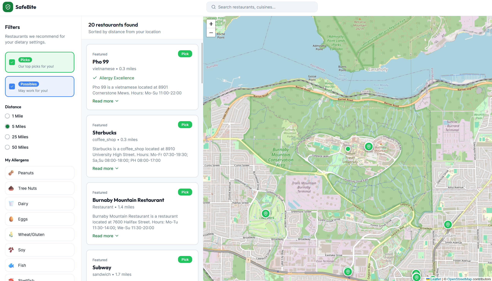
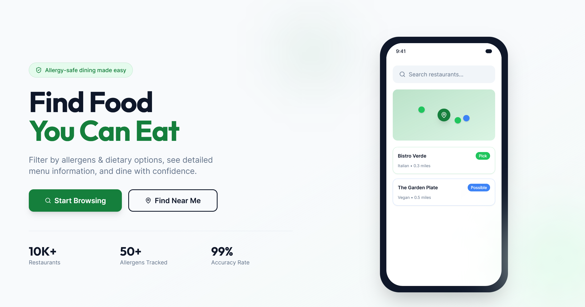

  

<h1 align="center">SafeBite</h1>

  <b>JourneyHacks 2026 Hackathon Project</b> 
  Team SafeBite with Jerry, Angad, Mike, and Kenzie.

  <a href="#about-the-project"><b>About The Project</b></a>
  &nbsp;·&nbsp;
  <a href="#how-it-works"><b>How It Works</b></a>
  &nbsp;·&nbsp;
  <a href="#tech-stack"><b>Tech Stack</b></a>
  &nbsp;·&nbsp;
  <a href="#team"><b>Team</b></a>

  
  
  
  

---

## About The Project

SafeBite is an allergy-safe dining discovery platform that helps people with food allergies find restaurants they can safely enjoy. Users can filter restaurants by their specific allergens, see detailed safety ratings, and discover new dining options with confidence.

### The Problem
People with food allergies face constant uncertainty when dining out. Traditional restaurant discovery apps don't provide the detailed allergen information needed to make safe dining decisions, leading to anxiety, limited dining options, and potential health risks.

### Our Solution
SafeBite provides a comprehensive platform where users can:
- Set their specific allergens and dietary restrictions
- Browse restaurants with safety ratings (Pick/Possible based on allergen presence)
- View interactive maps with restaurant locations
- Filter results based on dietary preferences and allergen safety

  

## How It Works

1. **Set Your Allergens**: Users input their specific food allergies and dietary restrictions
2. **Smart Filtering**: Our system categorizes restaurants as "Pick" (safe) or "Possible" (may contain allergens) based on user preferences
3. **Interactive Map**: Browse restaurant locations on an interactive map powered by Leaflet.js
4. **Real-Time Data**: Restaurant information is sourced from OpenStreetMap via the Overpass API

## Tech Stack

**Frontend:**
- React with TypeScript
- Tailwind CSS for styling
- shadcn/ui components
- Leaflet.js for interactive maps
- React Query for data fetching

**Backend:**
- Express.js server
- Overpass API integration
- RESTful API design
- CORS-enabled for cross-origin requests

**Data Sources:**
- OpenStreetMap via Overpass API
- Real-time restaurant location data
- Randomized allergen and dietary option assignments

## Key Features

- **Allergen-Safe Discovery**: Filter restaurants based on 14+ common allergens
- **Interactive Mapping**: Visual restaurant discovery with custom markers
- **Safety Ratings**: Clear "Pick" vs "Possible" ratings for each restaurant
- **Geolocation Support**: Find restaurants near your current location
- **Responsive Design**: Works seamlessly on desktop and mobile devices
- **Real-Time Search**: Live restaurant data from OpenStreetMap

  Built with care for the food allergy community during JourneyHacks 2026

